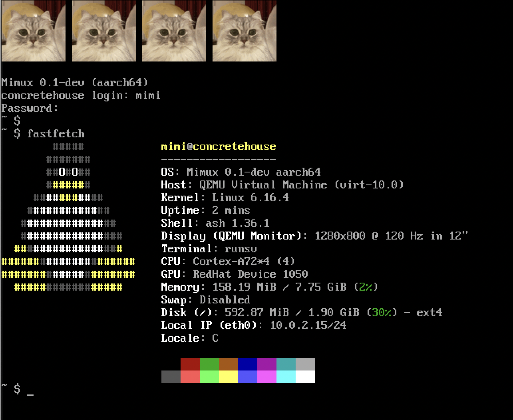

# Juni's Linux from Scratch



Just another deranged attempt at a Linux From Scratch, except not going by the
book. This is **very much** WIP, but if you would like instructions, see
[setup.md](./setup.md). Development is standardized around the alpine docker
image defined in the Dockerfile.

A lot of the init scripts were shamelessly ripped from Void Linux. Runit was
chosen as PID 1.

Goals:

1. Create a bootable image with a bootloader and all that
2. Have some (?) niceties on the system

Non-goals:

1. Get it to work on real hardware (I tried stripping down the kernel as much
   as possible, but this is maybe possible)

## To get the bootable image

Get into the container environment, then
```sh
./tools/setup_initramfs.sh # compiles the kernel and initramfs-related things.
./pkgs/userspace.sh # installs userspace packages
./tools/etc.sh # installs configuration files and sets up a user
./tools/bootable.sh # actually creates the bootable drive
```
