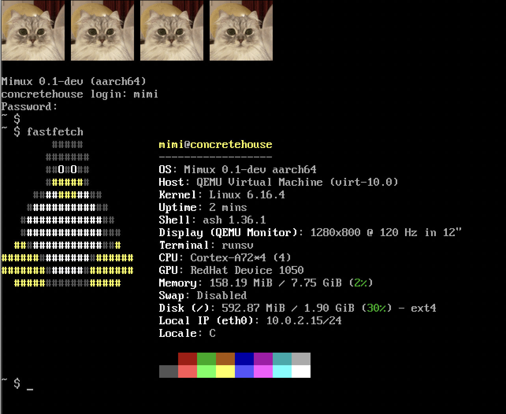
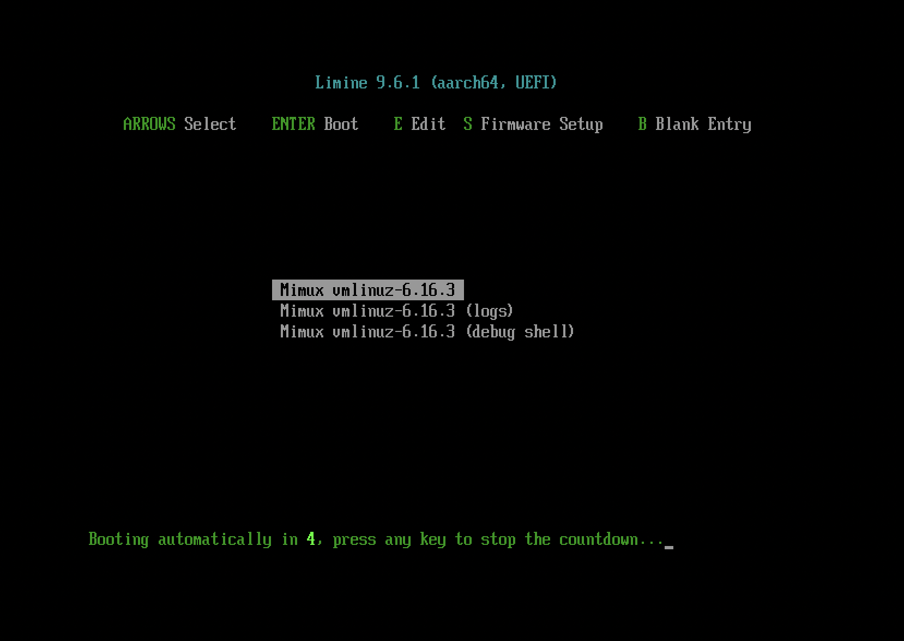

# Mimux


[](https://github.com/junikimm717/lfs/actions/workflows/build_aarch64.yml)
[](https://github.com/junikimm717/lfs/actions/workflows/build_x86.yml)

Named in memory of our cat Mimi (1/1/2022-5/13/2025).

Bootstrapping a from-scratch Linux-based OS with complete toolchain and runtime
(musl libc, gcc, chrony, runit), manually packaging 30+ core utilities (busybox,
openssl, perl) into a <600 MB bootable image, supporting x86_64 and aarch64.

The kernel has been manually configured to remove unnnecessary components and
sits at around 25MB. It also shows pictures of Mimi instead of the canonical Tux
:)

Mimux aims to be up-to-date with its core packages as possible and has an
automated CI-based system to aid in this. Packages are kept up-to-date with the latest
stable release. Statuses are publicly available at
[mxm.mit.junic.kim](https://mxm.mit.junic.kim)


Development is standardized around the Alpine Linux Docker image defined in the
Dockerfile. For further documentation on the Mimux build process, check out the
README's at [tools](./tools/) or [core](./core/).

I cannot believe I chose to undertake this project, but it's been quite
instructional and fun so far.

After two months of suffering, I also have personal beef against the perl build
system asdlfjas;lkdfjals;df (Also imagine goofy ahhh APFS not distinguishing
upper and lower case files names)

## Download (CI-Built)

All provided images here consist of a 2GB rootfs.

x86_64:

- [Bootable .img](https://github.com/junikimm717/lfs/releases/download/images/bootable-x86_64.img.gz)
- [rootfs tarball](https://github.com/junikimm717/lfs/releases/download/images/rootfs-x86_64.tar.gz)

aarch64:

- [Bootable .img](https://github.com/junikimm717/lfs/releases/download/images-aarch64/bootable-aarch64.img.gz)
- [rootfs tarball](https://github.com/junikimm717/lfs/releases/download/images-aarch64/rootfs-aarch64.tar.gz)

## Default OS Environment





The default configured bootloader will supply you with three boot modes:

1. *Mimux \$kernel* - Normal booting, normal init runs and you get dropped into a
   getty session
2. *Mimux \$kernel (logs)* - Same as above, except that kernel and init logs
   will be visible in the same tty where you log in.
3. *Mimux \$kernel (debug shell)* - You get dropped into an initramfs shell.

The default user is `mimi` and the password is `george` (his favorite chipmunk).
Root login is disabled by default; you can perform root commands via `doas`.

Mimux uses musl, busybox, and runit (init scripts shamelessly ripped from void)
to reduce bloat. However, the intention is that there are sufficiently many
build tools that theoretically you can build most things from source. `coco`
(below) is what makes that practical.

The default timezone is US Eastern Time. To change, run
```sh
ln -sfn /usr/share/zoneinfo/{whatever} /etc/localtime
```
like you would for any other barebones distro.

Below are some mimux-specific scripts provided for convenience:

- `update-cacert` - an extremely simple wrapper to update the CA certificates
  store from curl.se
- `mimux-test` - a wrapper to execute all test programs stored in `/usr/test`.
  These are mostly sanity checks on python and perl.

## In-Rootfs Build Script

Named after Mimi's brother Coco (4/29/2023 -). `coco` runs a package `build`
script from this repo on the booted system. Those scripts depend only on a
handful of environment variables rather than on the dev container, so `coco`
exports a native version of that environment and runs one unmodified:

```sh
coco ./mypackage/build all                        # download, build, install
ROOTFS="$HOME/stage" coco ./mypackage/build all   # ...or stage it elsewhere
coco                                              # a shell in that env
```

`ROOTFS` defaults to `/`, so a plain `build all` installs into the running
system and wants `doas`. Setting it elsewhere stages the install instead, and
the compiler and `pkg-config` search paths follow it.

## Graphical Layer and Additional Packages (`/coco`)

The core image is headless. **If you are looking to install more software, start
at `/coco`** — the whole opt-in [`extra/`](./extra/) tree ships in the image
there (Xorg, the bspwm window manager, st, a wallpaper, plus tmux/neovim/btop),
so the graphical layer can be built on the booted system rather than baked into
it:

```sh
doas /coco/builddeps/buildall   # meson, ninja, cmake (see below)
doas /coco/xorg/buildall        # the X11 stack
doas /coco/apps/buildall        # bspwm, st, fonts, wallpaper, session config
```

Then log in as `mimi` and run `xstart` to launch bspwm.

Each subdirectory of `/coco/xorg` and `/coco/apps` is a package with the same
`./build` contract as `core/`, so you can also build just one:

```sh
doas coco /coco/apps/tmux/build all
```

The orchestrators call `coco` themselves, which is why they are run directly.

A handful of those packages are built by `meson` or `cmake`, which the base
image does not ship — together they weigh ~229 MB installed, which is a lot to
carry for the few packages that need them. `/coco/builddeps` pulls them from
PyPI on demand, and both orchestrators will tell you to run it if they are
missing.

See [`extra/README.md`](./extra/README.md) for the package list and the bspwm
keybindings.

## Setup

The docker container is the *only* officially supported development environment
bc of tightly controlled dependencies and environment variables.

To launch into a dev shell, run `docker-compose up -d && ./tools/dev.sh`.

If you insist on a local environment (note COMPLETELY unsupported), install the
dependencies listed in `./Dockerfile` and then run

```sh
eval "$(./tools/env.sh)"
```

If a `build` script uses some random environment variable, it is almost
certainly defined in `./tools/env.sh`.

## Bootable Image Building

Execute the `./buildall.sh` with no arguments inside the dev container.
All final build artifacts will be located in `./dist/`.

On an M4 Pro Mac running Orbstack, this should take around 10 minutes to
complete. The GitHub CI takes around an hour to build each image.

### Baking in the graphical layer

The graphical layer (see `/coco` above) can also be bundled into the image at
build time rather than built on the booted system. Both stacks go on top of an
already-built rootfs, so run these after `./buildall.sh` and repackage:

```sh
./tools/graphical.sh   # the X11 stack (extra/xorg)
./tools/apps.sh        # bspwm/sxhkd/st + fonts + wallpaper + session config
./tools/bootable.sh    # fold the new rootfs contents into dist/bootable.img
```

They run inside the dev container like everything else, and are thin stubs over
`extra/xorg/buildall` and `extra/apps/buildall` — the same scripts `/coco`
ships. `tools/linux_boot.sh` is a graphical QEMU launcher for testing the
result.

## Virtual Machines

The kernel has been maximally stripped and has no module support. There is no
intention to support bare metal hardware.

If you're on Apple Silicon with Homebrew, congrats. Just run
`./tools/macos_boot.sh`; this should immediately boot up a working vm given you
installed qemu and efi firmware in the standard homebrew way.

Otherwise, the setup is a big clunky, but here are some pointers for configuring
with something like Virt-manager, UTM, etc.

1. The bootable image is located in `./dist/bootable.img`
2. Select the options that allow you to directly import a disk
3. **YOU MUST USE UEFI**!! This may be slightly tricky, but make sure you have
   vm firmware installed for this. This is enforced because I want a consistent
   boot environment across all cpu architectures.

## Version Checks

To ensure that packages with supported version checking are all up-to-date, you
should run the `./tools/versions.py` script. This script gets automatically run
by the CI on each commit as well.

Since build scripts may be incompatible across different package
versions/require tweaking to run, actual package bumps will be done manually.
